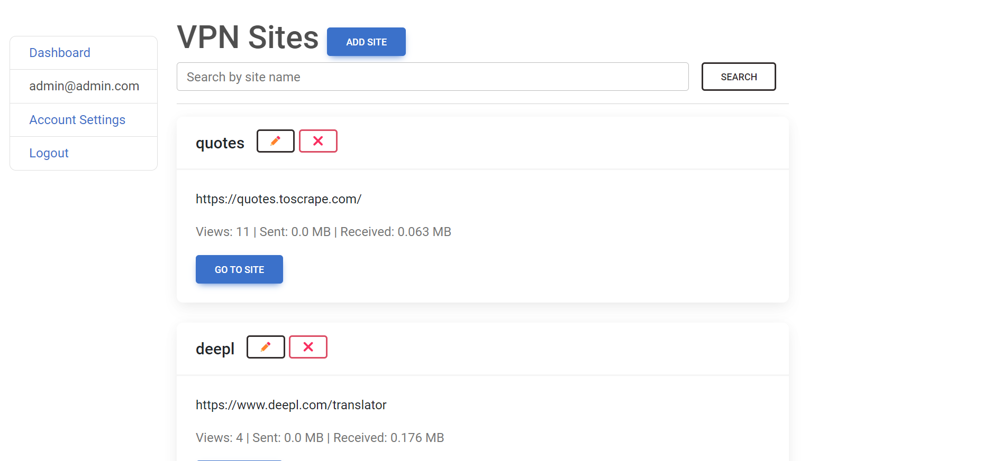

# 🌐 VPN Site Proxy 🚀

VPN Site Proxy is a Django web application that enables users to create a personalized virtual private network (VPN) where they can access and navigate external websites securely. The proxy modifies URLs to allow seamless internal routing and provides an enhanced browsing experience.

# 🚀 Getting Started

### Prerequisites

- Ensure you have Docker installed on your machine.

### Installation

1. Clone the repository: `git clone https://github.com/eduardhabryd/sheepfish-vpn-service-django.git`
2. Navigate to the project directory: `cd sheepfish-vpn-service-django`
3. Build and run the Docker image: `docker-compose up --build`
4. Access the website at `http://127.0.0.1:8000/`

# 📖 Features

### 🌐 Site Proxy

- Create a personalized VPN by adding external websites.
- Access external websites securely through an internal routing mechanism.

### 🔄 URL Modification

- Automatically modify external URLs to enable internal routing within the VPN.
- Seamless navigation between pages while preserving the user's VPN context.

### 🕵️‍♂️ User Authentication

- Override Django user authentication to use email instead of a username for enhanced security.

### 📈 Usage Statistics

- Track and display data usage statistics, including data sent and received during each session.
- Monitor the number of page views for each site in the VPN.

# 🛠️ Usage

- LOGIN: `admin@admin.com`
- PASSWORD: `admin`

# 🪟 DEMO

